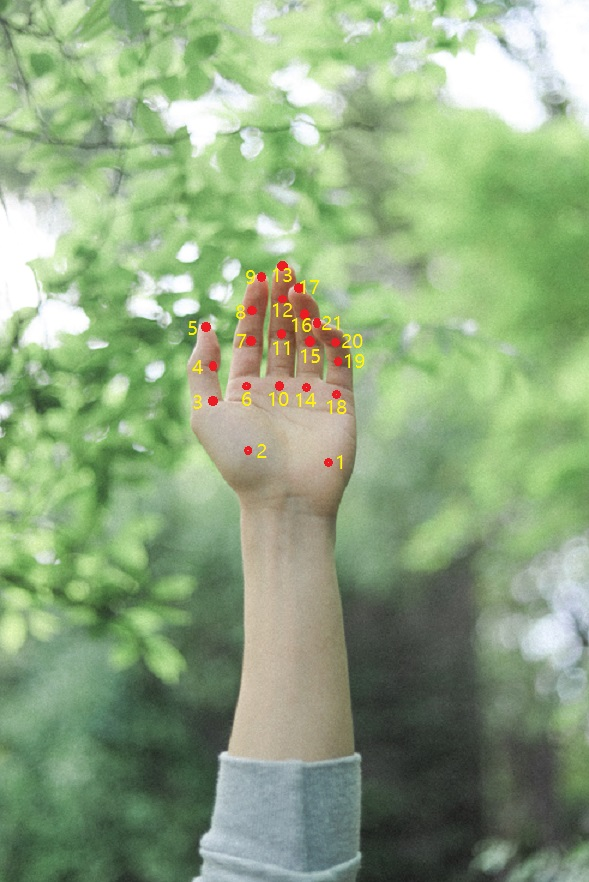
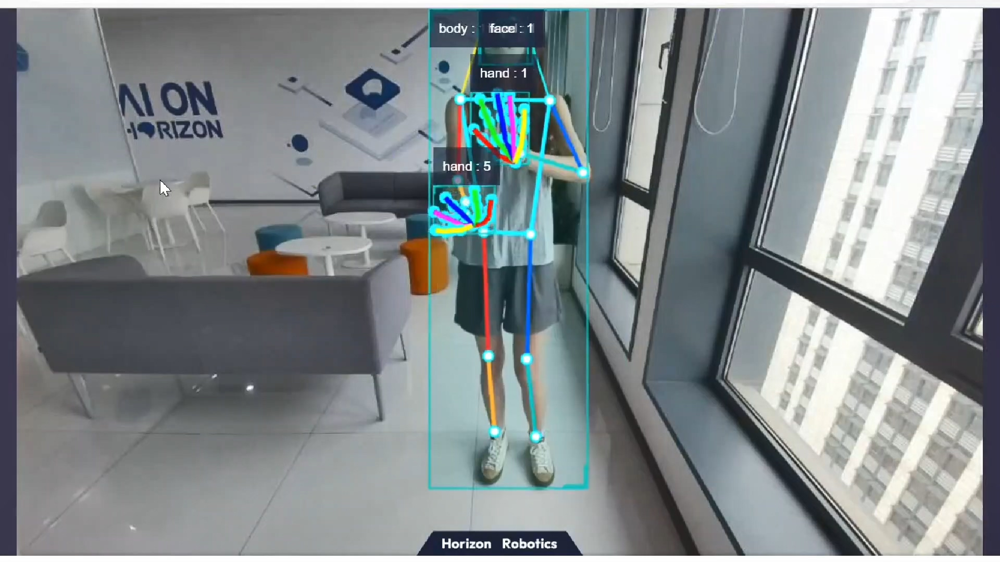

English| [简体中文](./README_cn.md)

# Function Introduction

The algorithm for detecting keypoints of hands subscribes to images and intelligent messages containing bounding box information of hands, utilizes BPU for algorithm reasoning, and publishes algorithm messages containing information of hand keypoints.

The hand keypoints index is as shown in the figure below:




# Bill of Materials

| Item Name           | Manufacturer | Reference Links                                              |
| :------------------ | ------------ | ------------------------------------------------------------ |
| RDK X3 / RDK Ultra  | Various      | [RDK X3](https://developer.horizon.cc/rdkx3)<br>[RDK Ultra](https://developer.horizon.cc/rdkultra) |
| camera              | Various      | [MIPI Camera](https://developer.horizon.cc/nodehubdetail/168958376283445781)<br>[USB Camera](https://developer.horizon.cc/nodehubdetail/168958376283445777)|


# Preparation

- The Horizon RDK has been flashed with the Ubuntu 20.04 system image provided by Horizon.
- The camera is correctly connected to the RDK X3.

# Instructions


**1. Install the Function Package**

After booting the robot, connect to the robot via SSH terminal or VNC, click the "One-click Deployment" button at the top right of this page, copy and run the following command on the RDK system to complete the installation of related nodes.

```bash
sudo apt update
sudo apt install -y tros-hand-lmk-detection
```

**2. Run the Hand Keypoint Detection Feature**

**Publishing Images Using MIPI Camera**

```shell
# Configure the tros.b environment
source /opt/tros/setup.bash

# Copy the necessary configuration files for running the example from the tros.b installation path.
cp -r /opt/tros/${TROS_DISTRO}/lib/mono2d_body_detection/config/ .
cp -r /opt/tros/${TROS_DISTRO}/lib/hand_lmk_detection/config/ .

# Configure the MIPI camera
export CAM_TYPE=mipi

# Launch the launch file

ros2 launch hand_lmk_detection hand_lmk_detection.launch.py
```

**Publish Images Using USB Camera**

```shell
# Set up the tros.b environment
source /opt/tros/setup.bash

# Copy the configuration files needed for running examples from the installation path of tros.b.
cp -r /opt/tros/${TROS_DISTRO}/lib/mono2d_body_detection/config/ .
cp -r /opt/tros/${TROS_DISTRO}/lib/hand_lmk_detection/config/ .

# Configure the USB camera
export CAM_TYPE=usb

# Launch the launch file
ros2 launch hand_lmk_detection hand_lmk_detection.launch.py
```

**3. Check the Result**

Open a web browser on the same network computer and visit [http://IP:8000](http://IP:8000) to see the real-time visual recognition effect, where IP is the IP address of RDK:


# API Description

## Topics

The results of hand keypoint detection are published through the [hobot_msgs/ai_msgs/msg/PerceptionTargets](https://github.com/HorizonRDK/hobot_msgs/blob/develop/ai_msgs/msg/PerceptionTargets.msg) topic, which is defined in detail as follows:
```shell
# Perception Results

# Message header
std_msgs/Header header

# Processing frame rate of perception results
# fps val is invalid if fps is less than 0
int16 fps

# Performance statistics, such as recording the time consumption of each model inference
Perf[] perfs

# Collection of perception targets
Target[] targets

# Collection of disappeared targets
Target[] disappeared_targets
```

| Name                    | Message Type                                   | Description                                         |
| ----------------------- | ------------------------------------------ | --------------------------------------- |
| /hobot_hand_lmk_detection | [hobot_msgs/ai_msgs/msg/PerceptionTargets](https://github.com/HorizonRDK/hobot_msgs/blob/develop/ai_msgs/msg/PerceptionTargets.msg) | Publish information about detected hand keypoints (only appears after gesture wake-up is enabled) |
| /hobot_mono2d_body_detection | [hobot_msgs/ai_msgs/msg/PerceptionTargets](https://github.com/HorizonRDK/hobot_msgs/blob/develop/ai_msgs/msg/PerceptionTargets.msg) | Subscribe to information about human body targets recognized by the previous node, including human body bounding box, face box, hand box, and human body keypoints |
| /hbmem_img | [hobot_msgs/hbm_img_msgs/msg/HbmMsg1080P](https://github.com/HorizonRDK/hobot_msgs/blob/develop/hbm_img_msgs/msg/HbmMsg1080P.msg) | When is_shared_mem_sub == 1, subscribe to image data published by the previous node using shared memory communication method |
| /image_raw | hsensor_msgs/msg/Image | When is_shared_mem_sub == 0, subscribe to related image data published by the previous node using ROS's normal subscription method |


## Parameters

| Parameter Name           | Type          | Explanation                                                                                                           | Required | Supported Configuration | Default Value |
| ----------------------- | ----------- | ------------------------------------------------------------------------------------------------------------------- | -------- | -------------------- | ---------------------------- |
| is_sync_mode            | int          | Synchronous/asynchronous inference mode. 0: asynchronous mode; 1: synchronous mode                                    | No       | 0/1                  | 0                            |
| model_file_name         | std::string  | Model file used for inference                                                                                        | No       | Configure the actual model path | config/handLMKs.hbm          |
| is_shared_mem_sub       | int          | Whether to subscribe to image messages using shared memory communication method. The topics for enabling and disabling shared memory communication for image subscription are /hbmem_img and /image_raw respectively. | 0/1  | 0/1                  | 0                            |
| ai_msg_pub_topic_name   | std::string  | Topic name for publishing messages containing results of human hand keypoint detection                            | No       | Configure based on deployment environment | /hobot_hand_lmk_detection    |
| ai_msg_sub_topic_name_  | std::string  | Topic name for subscribing to AI messages containing results of human hand bounding box detection                 | No       | Configure based on deployment environment | /hobot_mono2d_body_detection |
